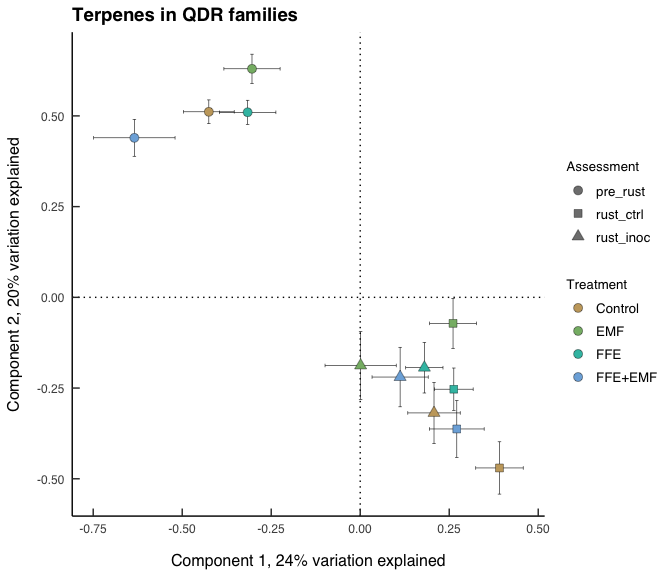
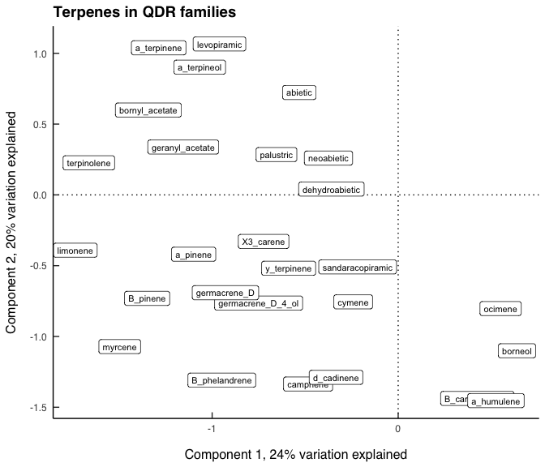
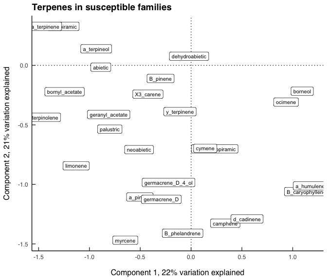
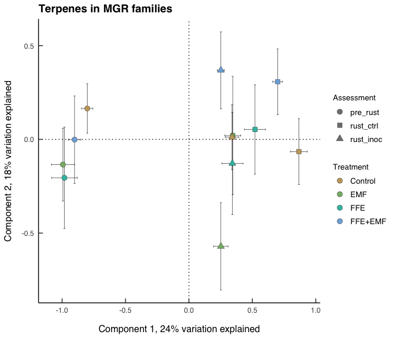

Global tests of terpene composition
================
Beau Larkin

Last updated: 31 March, 2023

- <a href="#description" id="toc-description">Description</a>
- <a href="#package-and-library-installation"
  id="toc-package-and-library-installation">Package and library
  installation</a>
- <a href="#data" id="toc-data">Data</a>
- <a href="#functions" id="toc-functions">Functions</a>
  - <a href="#terms" id="toc-terms">Terms</a>
- <a href="#results" id="toc-results">Results</a>
  - <a href="#tests-within-resistance-classes"
    id="toc-tests-within-resistance-classes">Tests within resistance
    classes</a>
  - <a href="#quantitative-gene-resistance-class-seedlings"
    id="toc-quantitative-gene-resistance-class-seedlings">Quantitative gene
    resistance class seedlings</a>
  - <a href="#susceptible-resistance-class-seedlings"
    id="toc-susceptible-resistance-class-seedlings">Susceptible resistance
    class seedlings</a>
  - <a href="#major-gene-resistance-class-seedlings"
    id="toc-major-gene-resistance-class-seedlings">Major gene resistance
    class seedlings</a>
  - <a href="#global-test" id="toc-global-test">Global test</a>

# Description

Permutation tests are used to test multivariate differences in terpene
composition among control, treatment, and assessment groups. One test is
done for each resistance class. Then, a global test is done using all
terpenes and testing resistance classes, treatments, and assessments.
For this test, the assessment variable is split into rust_trt and
collection to separate the effects of these components.

Greenhouse block is included in all tests.

# Package and library installation

Note that messages and code are often hidden in this notebook for
brevity.

``` r
# Package and library installation
packages_needed <-
  c("tidyverse", "magrittr", "knitr", "vegan", "colorspace")
packages_installed <-
  packages_needed %in% rownames(installed.packages())
```

``` r
if (any(!packages_installed))
  install.packages(packages_needed[!packages_installed])
```

``` r
for (i in 1:length(packages_needed)) {
  library(packages_needed[i], character.only = T)
}
```

# Data

See
[data_etl.md](https://github.com/bglarkin/wwp_terpenes/blob/main/data_etl.md)
for more description of the source data. Header views of each data table
are presented here. Names only provided here.

``` r
source("data_etl.R")
```

``` r
sapply(data, function(x)
  head(x, 2))
```

    ## $terpene_meta
    ## # A tibble: 2 × 7
    ##   tree_ID  year treatment assessment block family   resistance_class
    ##     <dbl> <dbl> <chr>     <chr>      <dbl> <chr>    <chr>           
    ## 1    1002  2019 FFE       pre_rust       1 ENDO-159 susceptible     
    ## 2    1003  2019 FFE       pre_rust       1 ENDO-159 susceptible     
    ## 
    ## $terpene
    ## # A tibble: 2 × 11
    ##   tree_ID  year treat…¹ asses…² block family class compo…³ mass_…⁴  mass resis…⁵
    ##     <dbl> <dbl> <chr>   <chr>   <dbl> <chr>  <chr> <chr>   <chr>   <dbl> <chr>  
    ## 1    1002  2019 FFE     pre_ru…     1 ENDO-… dite… dehydr… dw      0.421 suscep…
    ## 2    1002  2019 FFE     pre_ru…     1 ENDO-… dite… levopi… dw      8.63  suscep…
    ## # … with abbreviated variable names ¹​treatment, ²​assessment, ³​compound,
    ## #   ⁴​mass_type, ⁵​resistance_class
    ## 
    ## $tree_height
    ## # A tibble: 2 × 4
    ##   tree_ID ht6     ht5   ht1
    ##     <dbl> <chr> <dbl> <dbl>
    ## 1    1001 25       20   9.5
    ## 2    1002 43       29  15.3
    ## 
    ## $tree_meta
    ## # A tibble: 2 × 6
    ##   tree_ID family   block endo_trt rust_trt resistance_class
    ##     <dbl> <chr>    <dbl> <chr>    <chr>    <chr>           
    ## 1    1001 ENDO-159     1 FFE      Yes      susceptible     
    ## 2    1002 ENDO-159     1 FFE      Yes      susceptible     
    ## 
    ## $tree_rust_response
    ## # A tibble: 2 × 28
    ##   tree_ID inoc_dens   ht6   dm6   sv6 alive6  vig6   ht5   dm5   sv5  vig5   bi5
    ##     <dbl>     <dbl> <dbl> <dbl> <dbl> <chr>  <dbl> <dbl> <dbl> <dbl> <dbl> <dbl>
    ## 1    1001      3400    25     4     6 Yes        1    20     4     3     1     2
    ## 2    1002      3400    43     4     7 Yes        6    29     4     5     1     3
    ## # … with 16 more variables: nc5 <dbl>, pbr5 <dbl>, br5 <dbl>, ss5 <dbl>,
    ## #   dm4 <dbl>, sv4 <dbl>, ss4 <dbl>, dm3 <dbl>, sv3 <dbl>, vig3 <dbl>,
    ## #   bi3 <dbl>, nc3 <dbl>, pbr3 <dbl>, br3 <dbl>, ss3 <dbl>, ht1 <dbl>

# Functions

The following function produces the permutation tests and visual
ordination figures for each resistance class (permutations = 1999). The
test is run on individual trees; the ordination figures show centroids
and standard errors for assessment and treatment groups. Supplemental
ordinations of terpene compounds are also shown.

## Terms

- permutations = 19999
- data standardization: standardize columns (scale x to zero mean and
  unit variance)
- distance metric: euclidean
- ordination: PCA

``` r
terpene_pca <-
  function(c,
           bar_wd = 0.008,
           bar_sz = 0.2,
           pt_sz = 3,
           p = 1999) {
    cat("---------------------------------------------------------------------\n")
    cat(paste("Resistance type", c, "selected."))
    cat("\n---------------------------------------------------------------------\n")
    
    # Load styles inside function
    source("gg_style.txt")
    
    df <- data$terpene %>%
      filter(mass_type == "dw",
             resistance_class == c) %>%
      mutate(tree_key = paste(tree_ID, year, sep = "-")) %>%
      select(tree_key, treatment, assessment, compound, mass) %>%
      pivot_wider(
        names_from = compound,
        values_from = mass,
        values_fill = 0
      )
    X <- data.frame(df %>% select(-treatment,-assessment), row.names = 1)
    Y <- data.frame(df %>% select(treatment, assessment))
    set.seed(123)
    perm_test <-
      adonis2(
        scale(X) ~ assessment * treatment,
        data = Y,
        permutations = p,
        method = "euclidean"
      )
    
    terp_pca <- rda(X, scale = TRUE)
    sites <-
      data.frame(scores(terp_pca, "sites", choices = c(1, 2))) %>%
      rownames_to_column(var = "tree_key") %>%
      left_join(df %>% select(tree_key, treatment, assessment), by = "tree_key")
    site_centers <-
      sites %>%
      group_by(assessment, treatment) %>%
      summarize(
        PC1_mean = mean(PC1),
        PC1_se_pos = PC1_mean + (sd(PC1) / sqrt(length(PC1))),
        PC1_se_neg = PC1_mean - (sd(PC1) / sqrt(length(PC1))),
        PC2_mean = mean(PC2),
        PC2_se_pos = PC2_mean + (sd(PC2) / sqrt(length(PC2))),
        PC2_se_neg = PC2_mean - (sd(PC2) / sqrt(length(PC2))),
        .groups = "drop"
      )
    labs_pct <-
      round((terp_pca$CA$eig / sum(terp_pca$CA$eig))[1:2] * 100, 0)
    terp_centers <-
      data.frame(scores(terp_pca, "species", choices = c(1, 2))) %>%
      rownames_to_column(var = "compound")
    
    bar_width_d1 <-
      with(site_centers, max(PC1_se_pos) - min(PC1_se_neg)) * bar_wd
    bar_width_d2 <-
      with(site_centers, max(PC2_se_pos) - min(PC2_se_neg)) * bar_wd
    
    plot_ord <-
      ggplot(site_centers, aes(x = PC1_mean, y = PC2_mean)) +
      geom_vline(xintercept = 0, linetype = "dotted") +
      geom_hline(yintercept = 0, linetype = "dotted") +
      geom_errorbar(
        aes(x = PC1_mean, ymin = PC2_se_neg, ymax = PC2_se_pos),
        width = bar_width_d1,
        size = bar_sz
      ) +
      geom_errorbar(
        aes(y = PC2_mean, xmin = PC1_se_neg, xmax = PC1_se_pos),
        width = bar_width_d2,
        size = bar_sz
      ) +
      geom_point(aes(shape = assessment, fill = treatment),
                 size = pt_sz,
                 stroke = bar_sz) +
      labs(
        x = paste0("Component 1, ", labs_pct[1], "% variation explained"),
        y = paste0("Component 2, ", labs_pct[2], "% variation explained"),
        title = paste0("Terpenes in ", c, " families")
      ) +
      scale_shape_manual(name = "Assessment", values = c(21, 22, 24)) +
      scale_fill_discrete_qualitative(name = "Treatment", palette = "Harmonic") +
      guides(fill = guide_legend(override.aes = list(shape = 21)),
             shape = guide_legend(override.aes = list(fill = "gray50"))) +
      theme_classic() +
      theme_bgl
    
    plot_compounds <-
      ggplot(terp_centers, aes(x = PC1, y = PC2)) +
      geom_vline(xintercept = 0, linetype = "dotted") +
      geom_hline(yintercept = 0, linetype = "dotted") +
      geom_label(aes(label = compound), size = 8 * 0.36) +
      labs(
        x = paste0("Component 1, ", labs_pct[1], "% variation explained"),
        y = paste0("Component 2, ", labs_pct[2], "% variation explained"),
        title = paste0("Terpenes in ", c, " families")
      ) +
      theme_classic() +
      theme_bgl
    
    out <- list(permutation_test_result = perm_test)
    
    #+ figure_ordination
    print(plot_ord)
    print(plot_compounds)
    
    return(out)
    
  }
```

# Results

## Tests within resistance classes

Use of standardized terpene masses in a euclidean distance matrix
greatly improves clustering and increases separation in a permutation
test.

## Quantitative gene resistance class seedlings

    ## ---------------------------------------------------------------------
    ## Resistance type QDR selected.
    ## ---------------------------------------------------------------------

    ## Warning: Using `size` aesthetic for lines was deprecated in ggplot2 3.4.0.
    ## ℹ Please use `linewidth` instead.

<!-- --><!-- -->

    ## $permutation_test_result
    ## Permutation test for adonis under reduced model
    ## Terms added sequentially (first to last)
    ## Permutation: free
    ## Number of permutations: 1999
    ## 
    ## adonis2(formula = scale(X) ~ assessment * treatment, data = Y, permutations = p, method = "euclidean")
    ##                       Df SumOfSqs      R2       F Pr(>F)    
    ## assessment             2   1924.6 0.19855 48.6438  5e-04 ***
    ## treatment              3    408.4 0.04213  6.8814  5e-04 ***
    ## assessment:treatment   6    475.8 0.04909  4.0085  5e-04 ***
    ## Residual             348   6884.2 0.71023                   
    ## Total                359   9693.0 1.00000                   
    ## ---
    ## Signif. codes:  0 '***' 0.001 '**' 0.01 '*' 0.05 '.' 0.1 ' ' 1

## Susceptible resistance class seedlings

    ## ---------------------------------------------------------------------
    ## Resistance type susceptible selected.
    ## ---------------------------------------------------------------------

<!-- --><!-- -->

    ## $permutation_test_result
    ## Permutation test for adonis under reduced model
    ## Terms added sequentially (first to last)
    ## Permutation: free
    ## Number of permutations: 1999
    ## 
    ## adonis2(formula = scale(X) ~ assessment * treatment, data = Y, permutations = p, method = "euclidean")
    ##                       Df SumOfSqs      R2       F Pr(>F)    
    ## assessment             2   1380.6 0.21306 35.6175  5e-04 ***
    ## treatment              3    325.7 0.05026  5.6008  5e-04 ***
    ## assessment:treatment   6    335.3 0.05175  2.8837  5e-04 ***
    ## Residual             229   4438.4 0.68493                   
    ## Total                240   6480.0 1.00000                   
    ## ---
    ## Signif. codes:  0 '***' 0.001 '**' 0.01 '*' 0.05 '.' 0.1 ' ' 1

## Major gene resistance class seedlings

    ## ---------------------------------------------------------------------
    ## Resistance type MGR selected.
    ## ---------------------------------------------------------------------

<!-- --><!-- -->

    ## $permutation_test_result
    ## Permutation test for adonis under reduced model
    ## Terms added sequentially (first to last)
    ## Permutation: free
    ## Number of permutations: 1999
    ## 
    ## adonis2(formula = scale(X) ~ assessment * treatment, data = Y, permutations = p, method = "euclidean")
    ##                       Df SumOfSqs      R2       F Pr(>F)    
    ## assessment             2    737.1 0.23134 19.9015  5e-04 ***
    ## treatment              3    211.5 0.06637  3.8067  5e-04 ***
    ## assessment:treatment   6    256.1 0.08038  2.3051  5e-04 ***
    ## Residual             107   1981.4 0.62190                   
    ## Total                118   3186.0 1.00000                   
    ## ---
    ## Signif. codes:  0 '***' 0.001 '**' 0.01 '*' 0.05 '.' 0.1 ' ' 1

## Global test

- Split assessment into rust_trt and collection
- Include block

``` r
g_df <- data$terpene %>%
  filter(mass_type == "dw") %>%
  mutate(tree_key = paste(tree_ID, year, sep = "-"),
         rust_trt = case_when(
           assessment == "rust_inoc" ~ "rust", TRUE ~ "no_rust"),
         collection = case_when(
           assessment == "pre_rust" ~ "C1", TRUE ~ "C2")) %>%
  select(tree_key,
         block,
         resistance_class,
         treatment,
         rust_trt,
         collection,
         compound,
         mass) %>%
  pivot_wider(names_from = compound,
              values_from = mass,
              values_fill = 0)
g_X <-
  data.frame(g_df %>% select(-(block:collection)),
             row.names = 1)
g_Y <-
  data.frame(g_df %>% select(block:collection))
```

``` r
set.seed(123)
gp <- 
  adonis2(
    scale(g_X) ~ resistance_class * treatment * rust_trt * collection,
    data = g_Y,
    permutations = 1999,
    method = "euclidean",
    strata = g_Y$block
  )
```

``` r
padj_BH <- data.frame(
  p.val = gp$`Pr(>F)`,
  p.adj = p.adjust(gp$`Pr(>F)`, method = "BH") %>% round(., 4)
)
```

``` r
print(list(
  model = gp, 
  p_values_adjusted = padj_BH)
  )
```

    ## $model
    ## Permutation test for adonis under reduced model
    ## Terms added sequentially (first to last)
    ## Blocks:  strata 
    ## Permutation: free
    ## Number of permutations: 1999
    ## 
    ## adonis2(formula = scale(g_X) ~ resistance_class * treatment * rust_trt * collection, data = g_Y, permutations = 1999, method = "euclidean", strata = g_Y$block)
    ##                                        Df SumOfSqs      R2        F Pr(>F)    
    ## resistance_class                        2    964.7 0.04969  26.2398 0.0005 ***
    ## treatment                               3    678.9 0.03497  12.3111 0.0005 ***
    ## rust_trt                                1    712.3 0.03669  38.7495 0.0005 ***
    ## collection                              1   3063.2 0.15779 166.6403 0.0005 ***
    ## resistance_class:treatment              6    180.1 0.00928   1.6332 0.0025 ** 
    ## resistance_class:rust_trt               2     66.9 0.00345   1.8208 0.0210 *  
    ## treatment:rust_trt                      3    338.0 0.01741   6.1298 0.0005 ***
    ## resistance_class:collection             2    134.7 0.00694   3.6627 0.0005 ***
    ## treatment:collection                    3    501.3 0.02583   9.0911 0.0005 ***
    ## resistance_class:treatment:rust_trt     6     83.4 0.00429   0.7559 0.9055    
    ## resistance_class:treatment:collection   6    115.9 0.00597   1.0506 0.3550    
    ## Residual                              684  12573.5 0.64768                    
    ## Total                                 719  19413.0 1.00000                    
    ## ---
    ## Signif. codes:  0 '***' 0.001 '**' 0.01 '*' 0.05 '.' 0.1 ' ' 1
    ## 
    ## $p_values_adjusted
    ##     p.val  p.adj
    ## 1  0.0005 0.0008
    ## 2  0.0005 0.0008
    ## 3  0.0005 0.0008
    ## 4  0.0005 0.0008
    ## 5  0.0025 0.0034
    ## 6  0.0210 0.0257
    ## 7  0.0005 0.0008
    ## 8  0.0005 0.0008
    ## 9  0.0005 0.0008
    ## 10 0.9055 0.9055
    ## 11 0.3550 0.3905
    ## 12     NA     NA
    ## 13     NA     NA
