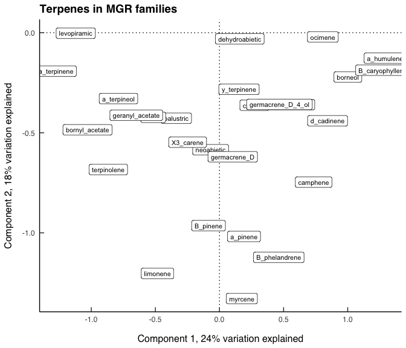

Global tests of terpene composition
================
Beau Larkin
2022-12-08

- <a href="#description" id="toc-description">Description</a>
- <a href="#package-and-library-installation"
  id="toc-package-and-library-installation">Package and library
  installation</a>
- <a href="#data" id="toc-data">Data</a>
- <a href="#results" id="toc-results">Results</a>
  - <a href="#susceptible-resistance-class-seedlings"
    id="toc-susceptible-resistance-class-seedlings">Susceptible resistance
    class seedlings</a>
  - <a href="#major-gene-resistance-class-seedlings"
    id="toc-major-gene-resistance-class-seedlings">Major gene resistance
    class seedlings</a>
  - <a href="#quantitative-gene-resistance-class-seedlings"
    id="toc-quantitative-gene-resistance-class-seedlings">Quantitative gene
    resistance class seedlings</a>

# Description

Permutation tests are used to test multivariate differences in terpene
composition among control, treatment, and assessment groups. One test is
done for each resistance class.

# Package and library installation

Note that messages and code are often hidden in this notebook for
brevity.

``` r
# Package and library installation
packages_needed <- c("tidyverse", "magrittr", "knitr", "vegan", "colorspace")
packages_installed <- packages_needed %in% rownames(installed.packages())
```

``` r
if (any(! packages_installed))
  install.packages(packages_needed[! packages_installed])
```

``` r
for (i in 1:length(packages_needed)) {
  library(packages_needed[i], character.only = T)
}
```

``` r
# Load ggplot styles and themes from text file
source("gg_style.txt")
```

# Data

See
[data_etl.md](https://github.com/bglarkin/wwp_terpenes/blob/main/data_etl.md)
for more description of the source data. Header views of each data table
are presented here. Names only provided here.

``` r
source("data_etl.R")
```

``` r
sapply(data, function(x) head(x, 2))
```

    ## $terpene_meta
    ## # A tibble: 2 × 7
    ##   tree_ID  year treatment assessment block family   resistance_class
    ##     <dbl> <dbl> <chr>     <chr>      <dbl> <chr>    <chr>           
    ## 1    1002  2019 FFE       pre_rust       1 ENDO-159 susceptible     
    ## 2    1003  2019 FFE       pre_rust       1 ENDO-159 susceptible     
    ## 
    ## $terpene
    ## # A tibble: 2 × 11
    ##   tree_ID  year treat…¹ asses…² block family class compo…³ mass_…⁴  mass resis…⁵
    ##     <dbl> <dbl> <chr>   <chr>   <dbl> <chr>  <chr> <chr>   <chr>   <dbl> <chr>  
    ## 1    1002  2019 FFE     pre_ru…     1 ENDO-… dite… dehydr… dw      0.421 suscep…
    ## 2    1002  2019 FFE     pre_ru…     1 ENDO-… dite… levopi… dw      8.63  suscep…
    ## # … with abbreviated variable names ¹​treatment, ²​assessment, ³​compound,
    ## #   ⁴​mass_type, ⁵​resistance_class
    ## 
    ## $tree_height
    ## # A tibble: 2 × 4
    ##   tree_ID ht6     ht5   ht1
    ##     <dbl> <chr> <dbl> <dbl>
    ## 1    1001 25       20   9.5
    ## 2    1002 43       29  15.3
    ## 
    ## $tree_meta
    ## # A tibble: 2 × 6
    ##   tree_ID family   block endo_trt rust_trt resistance_class
    ##     <dbl> <chr>    <dbl> <chr>    <chr>    <chr>           
    ## 1    1001 ENDO-159     1 FFE      Yes      susceptible     
    ## 2    1002 ENDO-159     1 FFE      Yes      susceptible     
    ## 
    ## $tree_rust_response
    ## # A tibble: 2 × 28
    ##   tree_ID inoc_dens   ht6   dm6   sv6 alive6  vig6   ht5   dm5   sv5  vig5   bi5
    ##     <dbl>     <dbl> <dbl> <dbl> <dbl> <chr>  <dbl> <dbl> <dbl> <dbl> <dbl> <dbl>
    ## 1    1001      3400    25     4     6 Yes        1    20     4     3     1     2
    ## 2    1002      3400    43     4     7 Yes        6    29     4     5     1     3
    ## # … with 16 more variables: nc5 <dbl>, pbr5 <dbl>, br5 <dbl>, ss5 <dbl>,
    ## #   dm4 <dbl>, sv4 <dbl>, ss4 <dbl>, dm3 <dbl>, sv3 <dbl>, vig3 <dbl>,
    ## #   bi3 <dbl>, nc3 <dbl>, pbr3 <dbl>, br3 <dbl>, ss3 <dbl>, ht1 <dbl>

# Results

The following function produces the permutation tests and visual
ordination figures for each resistance class (permutations = 1999). The
test is run on individual trees; the ordination figures show centroids
and standard errors for assessment and treatment groups. Supplemental
ordinations of terpene compounds are also shown.

``` r
terpene_pcoa <- function(c, dim1_exp = 1, dim2_exp = 1, bar_wd = 0.008, bar_sz = 0.2, pt_sz = 3) {

  cat("---------------------------------------------------------------------\n")
  cat(paste("Resistance type", c, "selected."))
  cat("\n---------------------------------------------------------------------\n")
  
  # Load styles inside function
  source("gg_style.txt")

  df <- data$terpene %>%
    filter(mass_type == "dw",
           resistance_class == c) %>%
    mutate(tree_key = paste(tree_ID, year, sep = "-")) %>%
    select(tree_key, treatment, assessment, compound, mass) %>%
    pivot_wider(names_from = compound, values_from = mass, values_fill = 0)
  terp <-
    data.frame(df %>% select(-treatment, -assessment), row.names = 1)
  expl <- data.frame(df %>% select(treatment, assessment))
  set.seed(123)
  perm_test <-
    adonis2(
      terp ~ assessment * treatment,
      data = expl,
      permutations = 1999,
      method = "bray",
      sqrt.dist = TRUE,
      by = "terms"
    )

  terp_bray <- vegdist(terp, "bray")
  terp_pcoa <-
    cmdscale(sqrt(terp_bray), k = (nrow(terp) - 1), eig = TRUE)
  sites <-
    data.frame(scores(terp_pcoa, "sites", choices = c(1, 2))) %>%
    rownames_to_column(var = "tree_key") %>%
    left_join(df %>% select(tree_key, treatment, assessment), by = "tree_key")
  site_centers <-
    sites %>%
    group_by(assessment, treatment) %>%
    summarize(Dim1_mean = mean(Dim1),
              Dim1_se_pos = Dim1_mean + (sd(Dim1) / sqrt(length(Dim1))),
              Dim1_se_neg = Dim1_mean - (sd(Dim1) / sqrt(length(Dim1))),
              Dim2_mean = mean(Dim2),
              Dim2_se_pos = Dim2_mean + (sd(Dim2) / sqrt(length(Dim2))),
              Dim2_se_neg = Dim2_mean - (sd(Dim2) / sqrt(length(Dim2))),
              .groups = "drop")
  labs_pct <-
    round((terp_pcoa$eig / sum(terp_pcoa$eig))[1:2] * 100, 0)
  terp_wa <-
    data.frame(wascores(terp_pcoa$points[, 1:2], terp, expand = FALSE)) %>%
    rownames_to_column(var = "compound")

  bar_width_d1 <- with(site_centers, max(Dim1_se_pos) - min(Dim1_se_neg)) * bar_wd
  bar_width_d2 <- with(site_centers, max(Dim2_se_pos) - min(Dim2_se_neg)) * bar_wd

  plot_ord <-
    ggplot(site_centers, aes(x = Dim1_mean, y = Dim2_mean)) +
    geom_vline(xintercept = 0, linetype = "dotted") +
    geom_hline(yintercept = 0, linetype = "dotted") +
    geom_errorbar(
      aes(x = Dim1_mean, ymin = Dim2_se_neg, ymax = Dim2_se_pos),
      width = bar_width_d1,
      size = bar_sz
    ) +
    geom_errorbar(
      aes(y = Dim2_mean, xmin = Dim1_se_neg, xmax = Dim1_se_pos),
      width = bar_width_d2,
      size = bar_sz
    ) +
    geom_point(
      aes(shape = assessment, fill = treatment),
      size = pt_sz,
      stroke = bar_sz) +
    labs(
      x = paste0("Dimension 1, ", labs_pct[1], "% variation explained"),
      y = paste0("Dimension 2, ", labs_pct[2], "% variation explained"),
      title = paste0("Terpenes in ", c, " families")
    ) +
    scale_shape_manual(name = "Assessment", values = c(21,22,24)) +
    scale_fill_discrete_qualitative(name = "Treatment", palette = "Harmonic") +
    guides(fill = guide_legend(override.aes = list(shape = 21)),
           shape = guide_legend(override.aes = list(fill = "gray50"))) +
    theme_bgl

  out <- list(
    permutation_test_result = perm_test
  )
  
  plot_compounds <- 
    ggplot(terp_wa, aes(x = X1, y = X2)) +
    geom_vline(xintercept = 0, linetype = "dotted") +
    geom_hline(yintercept = 0, linetype = "dotted") +
    geom_label(
      aes(label = compound),
      family = "serif",
      size = 8 * 0.36
    ) +
    labs(
      x = paste0("Dimension 1, ", labs_pct[1], "% variation explained"),
      y = paste0("Dimension 2, ", labs_pct[2], "% variation explained"),
      title = paste0("Terpenes in ", c, " families")
    ) +
    theme_bgl
  
  #+ figure_ordination
  print(plot_ord)
  print(plot_compounds)

  return(out)

}
```

## Susceptible resistance class seedlings

    ## ---------------------------------------------------------------------
    ## Resistance type susceptible selected.
    ## ---------------------------------------------------------------------

<!-- --><!-- -->

    ## $permutation_test_result
    ## Permutation test for adonis under reduced model
    ## Terms added sequentially (first to last)
    ## Permutation: free
    ## Number of permutations: 1999
    ## 
    ## adonis2(formula = terp ~ assessment * treatment, data = expl, permutations = 1999, method = "bray", sqrt.dist = TRUE, by = "terms")
    ##                       Df SumOfSqs      R2      F Pr(>F)    
    ## assessment             2    1.486 0.04561 5.8021 0.0005 ***
    ## treatment              3    0.853 0.02619 2.2208 0.0005 ***
    ## assessment:treatment   6    0.916 0.02810 1.1915 0.1185    
    ## Residual             229   29.328 0.90010                  
    ## Total                240   32.583 1.00000                  
    ## ---
    ## Signif. codes:  0 '***' 0.001 '**' 0.01 '*' 0.05 '.' 0.1 ' ' 1

## Major gene resistance class seedlings

    ## ---------------------------------------------------------------------
    ## Resistance type MGR selected.
    ## ---------------------------------------------------------------------

<!-- --><!-- -->

    ## $permutation_test_result
    ## Permutation test for adonis under reduced model
    ## Terms added sequentially (first to last)
    ## Permutation: free
    ## Number of permutations: 1999
    ## 
    ## adonis2(formula = terp ~ assessment * treatment, data = expl, permutations = 1999, method = "bray", sqrt.dist = TRUE, by = "terms")
    ##                       Df SumOfSqs      R2      F Pr(>F)    
    ## assessment             2   1.0920 0.07197 4.6314 0.0005 ***
    ## treatment              3   0.5625 0.03707 1.5904 0.0180 *  
    ## assessment:treatment   6   0.9040 0.05958 1.2780 0.0505 .  
    ## Residual             107  12.6144 0.83138                  
    ## Total                118  15.1729 1.00000                  
    ## ---
    ## Signif. codes:  0 '***' 0.001 '**' 0.01 '*' 0.05 '.' 0.1 ' ' 1

## Quantitative gene resistance class seedlings

    ## ---------------------------------------------------------------------
    ## Resistance type QDR selected.
    ## ---------------------------------------------------------------------

<!-- --><!-- -->

    ## $permutation_test_result
    ## Permutation test for adonis under reduced model
    ## Terms added sequentially (first to last)
    ## Permutation: free
    ## Number of permutations: 1999
    ## 
    ## adonis2(formula = terp ~ assessment * treatment, data = expl, permutations = 1999, method = "bray", sqrt.dist = TRUE, by = "terms")
    ##                       Df SumOfSqs      R2      F Pr(>F)    
    ## assessment             2    2.618 0.05099 9.7065 0.0005 ***
    ## treatment              3    0.876 0.01706 2.1652 0.0010 ***
    ## assessment:treatment   6    0.919 0.01790 1.1358 0.1880    
    ## Residual             348   46.930 0.91405                  
    ## Total                359   51.342 1.00000                  
    ## ---
    ## Signif. codes:  0 '***' 0.001 '**' 0.01 '*' 0.05 '.' 0.1 ' ' 1
