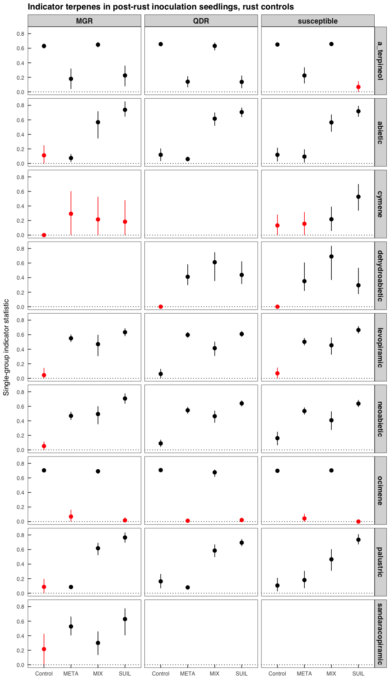

Identifying indicator terpenes for assessments, treatments, and
resistance classes
================
Beau Larkin
2022-12-09

- <a href="#description" id="toc-description">Description</a>
- <a href="#package-and-library-installation"
  id="toc-package-and-library-installation">Package and library
  installation</a>
- <a href="#data" id="toc-data">Data</a>
- <a href="#functions" id="toc-functions">Functions</a>
  - <a href="#post-rust-function" id="toc-post-rust-function">Post-rust
    function</a>
- <a href="#results" id="toc-results">Results</a>
  - <a href="#pre-rust-results" id="toc-pre-rust-results">Pre-rust
    results</a>
    - <a href="#plot-of-indicators-and-confidence-intervals"
      id="toc-plot-of-indicators-and-confidence-intervals">Plot of indicators
      and confidence intervals</a>
  - <a href="#post-rust-results" id="toc-post-rust-results">Post-rust
    results</a>
    - <a href="#rust-control-seedlings" id="toc-rust-control-seedlings">Rust
      control seedlings</a>
    - <a href="#plot-of-indicators-and-confidence-intervals-1"
      id="toc-plot-of-indicators-and-confidence-intervals-1">Plot of
      indicators and confidence intervals</a>
    - <a href="#rust-inoculated-seedlings"
      id="toc-rust-inoculated-seedlings">Rust-inoculated seedlings</a>

# Description

We’d like to know which terpene compounds associate strongly with
particular assessments or treatments. In multivariate analysis jargon,
the terpenes are “species”, and performing an indicator species analysis
is a creative, but appropriate way to test the specificity and fidelity
of terpenes. Indicators are determined using the concepts “specificity”
and “fidelity”, as explained by [Borcard et
al. 2018](https://doi.org/10.1007/978-3-319-71404-2) (page 120):

> “Indicator value indices are based on the concepts of specificity
> (highest when the species is present in the target group but not
> elsewhere) and fidelity (highest when the species is present in all
> sites of the target group). A high indicator value is obtained by a
> combination of high specificity and fidelity.

The package [indicspecies](https://doi.org/10.1890/08-1823.1) (De
Caceres & Legendre 2009) is used to conduct the indicator species
analysis. Indicspecies identifies species with specificity and fidelity
to sites (in this case, seedlings) grouped by treatments, and then pools
groups, looking for indicators of two, then three, or more (if present)
treatment groups. The groupings can sometimes be difficult to interpret;
for example, when indicators are found for groupings of control and
treatment seedlings.

Finally, the function `strassoc()` is used to produce bootstrapped
confidence intervals on indicator’s strength of association to groups.
The additional post-hoc test hopefully reduces the need for or concern
over p-value corrections to `multipatt()`.

Indicator species analysis here is run on subsets of the seedling
response data:

1.  **Pre-rust inoculation seedlings with resistance classes run
    independently.** This test looks for constitutive differences among
    seedlings and early responses to treatment inoculations.
2.  **Post-rust inoculation seedlings, separated into rust_trt and
    rust_ctrl groups with resistance classes run independently.** This
    test looks for constitutive differences among seedlings (rust_ctrl),
    later responses to treatment inoculations, and induced responses
    crossed with treatments in rust_inoc.
3.  **Post rust inoculated seedlings, treatment controls only, with
    resistance classes run independently.** This test looks for induced
    differences among resistance classes due only to blister rust
    inoculation.

# Package and library installation

Note that messages and code are often hidden in this notebook for
brevity.

``` r
# Package and library installation
packages_needed <- c("tidyverse", "knitr", "indicspecies")
packages_installed <-
  packages_needed %in% rownames(installed.packages())
```

``` r
if (any(!packages_installed))
  install.packages(packages_needed[!packages_installed])
```

``` r
for (i in 1:length(packages_needed)) {
  library(packages_needed[i], character.only = T)
}
```

# Data

See
[data_etl.md](https://github.com/bglarkin/wwp_terpenes/blob/main/data_etl.md)
for more description of the source data. Header views of each data table
are presented here. Names only provided here.

``` r
source("data_etl.R")
```

``` r
sapply(data, function(x)
  head(x, 2))
```

    ## $terpene_meta
    ## # A tibble: 2 × 7
    ##   tree_ID  year treatment assessment block family   resistance_class
    ##     <dbl> <dbl> <chr>     <chr>      <dbl> <chr>    <chr>           
    ## 1    1002  2019 FFE       pre_rust       1 ENDO-159 susceptible     
    ## 2    1003  2019 FFE       pre_rust       1 ENDO-159 susceptible     
    ## 
    ## $terpene
    ## # A tibble: 2 × 11
    ##   tree_ID  year treat…¹ asses…² block family class compo…³ mass_…⁴  mass resis…⁵
    ##     <dbl> <dbl> <chr>   <chr>   <dbl> <chr>  <chr> <chr>   <chr>   <dbl> <chr>  
    ## 1    1002  2019 FFE     pre_ru…     1 ENDO-… dite… dehydr… dw      0.421 suscep…
    ## 2    1002  2019 FFE     pre_ru…     1 ENDO-… dite… levopi… dw      8.63  suscep…
    ## # … with abbreviated variable names ¹​treatment, ²​assessment, ³​compound,
    ## #   ⁴​mass_type, ⁵​resistance_class
    ## 
    ## $tree_height
    ## # A tibble: 2 × 4
    ##   tree_ID ht6     ht5   ht1
    ##     <dbl> <chr> <dbl> <dbl>
    ## 1    1001 25       20   9.5
    ## 2    1002 43       29  15.3
    ## 
    ## $tree_meta
    ## # A tibble: 2 × 6
    ##   tree_ID family   block endo_trt rust_trt resistance_class
    ##     <dbl> <chr>    <dbl> <chr>    <chr>    <chr>           
    ## 1    1001 ENDO-159     1 FFE      Yes      susceptible     
    ## 2    1002 ENDO-159     1 FFE      Yes      susceptible     
    ## 
    ## $tree_rust_response
    ## # A tibble: 2 × 28
    ##   tree_ID inoc_dens   ht6   dm6   sv6 alive6  vig6   ht5   dm5   sv5  vig5   bi5
    ##     <dbl>     <dbl> <dbl> <dbl> <dbl> <chr>  <dbl> <dbl> <dbl> <dbl> <dbl> <dbl>
    ## 1    1001      3400    25     4     6 Yes        1    20     4     3     1     2
    ## 2    1002      3400    43     4     7 Yes        6    29     4     5     1     3
    ## # … with 16 more variables: nc5 <dbl>, pbr5 <dbl>, br5 <dbl>, ss5 <dbl>,
    ## #   dm4 <dbl>, sv4 <dbl>, ss4 <dbl>, dm3 <dbl>, sv3 <dbl>, vig3 <dbl>,
    ## #   bi3 <dbl>, nc3 <dbl>, pbr3 <dbl>, br3 <dbl>, ss3 <dbl>, ht1 <dbl>

# Functions

Two wrapper functions are used to produce summaries of the function
`multipatt()`. Two functions are needed because with the pre-rust
assessment, only treatments are considered within each resistance class.
Post-rust, assessments and treatments must be considered within each
resistance class. \## Pre-rust function

``` r
indVal_prerust_ci <- data.frame()
indic_pre <- function(rc, a="pre_rust", p=999, nb=999) {
  df <- data$terpene %>%
    filter(mass_type == "dw",
           assessment == a,
           resistance_class == rc) %>%
    select(tree_ID, treatment, assessment, compound, mass) %>%
    pivot_wider(
      names_from = compound,
      values_from = mass,
      values_fill = 0
    )
  X <- data.frame(df %>% select(-treatment,-assessment),
                  row.names = 1)
  Y <- data.frame(df %>% select(tree_ID, treatment, assessment),
                  row.names = 1)
  indVal <- multipatt(
    X,
    Y$treatment,
    control = how(nperm = p)
  )
  
  ind_compounds <- indVal$sign %>% 
    filter(!is.na(p.value)) %>% 
    rownames()
  
  indVal_boot <- strassoc(X, Y$treatment, func = "IndVal.g", nboot=nb)
  
  indVal_prerust_ci <<- 
  rbind(
    indVal_prerust_ci,
  lapply(indVal_boot, function(x) {
    data.frame(x) %>% 
      rownames_to_column(var = "compound") %>% 
      filter(compound %in% ind_compounds) %>% 
      mutate(resistance_class = rc,
             assessment = a) %>% 
      select(resistance_class, assessment, compound, everything())
    }) %>% 
    bind_rows(.id = "parameter") %>% 
    pivot_longer(cols = Control:FFE.EMF, names_to = "treatment") %>% 
    pivot_wider(names_from = parameter, values_from = value)
  )
  
  print(rc)
  summary(indVal, indvalcomp = TRUE)
  
}
```

## Post-rust function

``` r
indVal_postrust_ci <- data.frame()
indic_post <- function(rc, a, p=999, nb=999) {
  df <- data$terpene %>%
    filter(mass_type == "dw",
           assessment == a,
           resistance_class == rc) %>% 
    select(tree_ID, treatment, assessment, compound, mass) %>%
    pivot_wider(
      names_from = compound,
      values_from = mass,
      values_fill = 0
    )
  X <- data.frame(df %>% select(-treatment,-assessment),
                  row.names = 1)
  Y <- data.frame(df %>% select(tree_ID, treatment, assessment),
                  row.names = 1)
  indVal <- multipatt(
    X,
    Y$treatment,
    control = how(nperm = 999)
  )
  
  ind_compounds <- indVal$sign %>% 
    filter(!is.na(p.value)) %>% 
    rownames()
  
  indVal_boot <- strassoc(X, Y$treatment, func = "IndVal.g", nboot=nb)
  
  indVal_postrust_ci <<- 
    rbind(
      indVal_postrust_ci,
      lapply(indVal_boot, function(x) {
        data.frame(x) %>% 
          rownames_to_column(var = "compound") %>% 
          filter(compound %in% ind_compounds) %>% 
          mutate(resistance_class = rc,
                 assessment = a) %>% 
          select(resistance_class, assessment, compound, everything())
      }) %>% 
        bind_rows(.id = "parameter") %>% 
        pivot_longer(cols = Control:FFE.EMF, names_to = "treatment") %>% 
        pivot_wider(names_from = parameter, values_from = value)
    )
  
  print(paste(a, rc, sep = ", "))
  summary(indVal, indvalcomp = TRUE)
  
}
```

# Results

## Pre-rust results

#### Indicators in QDR seedlings

``` r
indic_pre("QDR")
```

    ## [1] "QDR"
    ## 
    ##  Multilevel pattern analysis
    ##  ---------------------------
    ## 
    ##  Association function: IndVal.g
    ##  Significance level (alpha): 0.05
    ## 
    ##  Total number of species: 23
    ##  Selected number of species: 0 
    ##  Number of species associated to 1 group: 0 
    ##  Number of species associated to 2 groups: 0 
    ##  Number of species associated to 3 groups: 0 
    ## 
    ##  List of species associated to each combination: 
    ## ---
    ## Signif. codes:  0 '***' 0.001 '**' 0.01 '*' 0.05 '.' 0.1 ' ' 1

No terpenes identified.

#### Indicators in susceptible seedlings

``` r
indic_pre("susceptible")
```

    ## [1] "susceptible"
    ## 
    ##  Multilevel pattern analysis
    ##  ---------------------------
    ## 
    ##  Association function: IndVal.g
    ##  Significance level (alpha): 0.05
    ## 
    ##  Total number of species: 23
    ##  Selected number of species: 1 
    ##  Number of species associated to 1 group: 0 
    ##  Number of species associated to 2 groups: 0 
    ##  Number of species associated to 3 groups: 1 
    ## 
    ##  List of species associated to each combination: 
    ## 
    ##  Group EMF+FFE+FFE+EMF  #sps.  1 
    ##              A      B  stat p.value    
    ## abietic 0.8907 1.0000 0.944   0.001 ***
    ## ---
    ## Signif. codes:  0 '***' 0.001 '**' 0.01 '*' 0.05 '.' 0.1 ' ' 1

Abietic acid identified as an indicator in all treatment seedlings, as
opposed to controls, with decent specificity and very high fidelity.

#### Indicators in MGR seedlings

``` r
indic_pre("MGR")
```

    ## [1] "MGR"
    ## 
    ##  Multilevel pattern analysis
    ##  ---------------------------
    ## 
    ##  Association function: IndVal.g
    ##  Significance level (alpha): 0.05
    ## 
    ##  Total number of species: 23
    ##  Selected number of species: 1 
    ##  Number of species associated to 1 group: 0 
    ##  Number of species associated to 2 groups: 0 
    ##  Number of species associated to 3 groups: 1 
    ## 
    ##  List of species associated to each combination: 
    ## 
    ##  Group EMF+FFE+FFE+EMF  #sps.  1 
    ##              A      B  stat p.value    
    ## abietic 0.9073 0.9583 0.932   0.001 ***
    ## ---
    ## Signif. codes:  0 '***' 0.001 '**' 0.01 '*' 0.05 '.' 0.1 ' ' 1

Abietic acid identified as an indicator in all treatment seedlings, as
opposed to controls, with decent specificity and very high fidelity.

### Plot of indicators and confidence intervals

The plot below shows indicator statistics and confidence intervals on
single-group comparisons. The statistic shown may not match a
significant pooled-group statistic if one was found using `multipatt()`.
Confidence intervals are based on boostrap replication in `strassoc()`
(n=1000). Confidence intervals which overlap zero mean that the
statistic is non-significant.

<!-- -->

## Post-rust results

### Rust control seedlings

Indicator species analyses in rust controls often show terpenes pooled
in groups that combine control and symbiont treatments, which is
difficult to interpret. The first run looked for indicators in single
treatment groups; with none found, the analysis was restricted to
indicators in treatments vs. controls.

#### Indicators in QDR seedlings

``` r
indic_post("QDR", "rust_ctrl")
```

    ## [1] "rust_ctrl, QDR"
    ## 
    ##  Multilevel pattern analysis
    ##  ---------------------------
    ## 
    ##  Association function: IndVal.g
    ##  Significance level (alpha): 0.05
    ## 
    ##  Total number of species: 26
    ##  Selected number of species: 7 
    ##  Number of species associated to 1 group: 0 
    ##  Number of species associated to 2 groups: 4 
    ##  Number of species associated to 3 groups: 3 
    ## 
    ##  List of species associated to each combination: 
    ## 
    ##  Group Control+FFE+EMF  #sps.  2 
    ##                  A      B  stat p.value    
    ## ocimene     0.9900 0.9667 0.978   0.001 ***
    ## a_terpineol 0.8580 0.9667 0.911   0.001 ***
    ## 
    ##  Group EMF+FFE+EMF  #sps.  2 
    ##                A      B  stat p.value    
    ## abietic   0.9366 0.9322 0.934   0.001 ***
    ## palustric 0.8937 0.9153 0.904   0.001 ***
    ## 
    ##  Group EMF+FFE+FFE+EMF  #sps.  3 
    ##                     A      B  stat p.value    
    ## neoabietic     0.9759 0.9326 0.954   0.001 ***
    ## levopiramic    0.9724 0.8989 0.935   0.001 ***
    ## dehydroabietic 1.0000 0.7978 0.893   0.001 ***
    ## ---
    ## Signif. codes:  0 '***' 0.001 '**' 0.01 '*' 0.05 '.' 0.1 ' ' 1

No terpenes are indicators for one treatment group. Neoabietic,
levopiramic, and dehydroabietic are indicators for treatments, as
opposed to controls.

#### Indicators in susceptible seedlings

``` r
indic_post("susceptible", "rust_ctrl")
```

    ## [1] "rust_ctrl, susceptible"
    ## 
    ##  Multilevel pattern analysis
    ##  ---------------------------
    ## 
    ##  Association function: IndVal.g
    ##  Significance level (alpha): 0.05
    ## 
    ##  Total number of species: 26
    ##  Selected number of species: 7 
    ##  Number of species associated to 1 group: 0 
    ##  Number of species associated to 2 groups: 3 
    ##  Number of species associated to 3 groups: 4 
    ## 
    ##  List of species associated to each combination: 
    ## 
    ##  Group Control+FFE+EMF  #sps.  2 
    ##                  A      B  stat p.value    
    ## ocimene     0.9818 1.0000 0.991   0.001 ***
    ## a_terpineol 0.8562 1.0000 0.925   0.001 ***
    ## 
    ##  Group EMF+FFE+EMF  #sps.  1 
    ##              A      B  stat p.value    
    ## abietic 0.9136 0.9024 0.908   0.001 ***
    ## 
    ##  Group EMF+FFE+FFE+EMF  #sps.  4 
    ##                     A      B  stat p.value    
    ## levopiramic    0.9686 0.9180 0.943   0.001 ***
    ## neoabietic     0.9478 0.8852 0.916   0.001 ***
    ## palustric      0.9442 0.7869 0.862   0.001 ***
    ## dehydroabietic 1.0000 0.7377 0.859   0.001 ***
    ## ---
    ## Signif. codes:  0 '***' 0.001 '**' 0.01 '*' 0.05 '.' 0.1 ' ' 1

No terpenes are indicators for one treatment group. Levopiramic,
neoabietic, palustric, and dehydroabietic are indicators for treatments,
as opposed to controls.

#### Indicators in MGR seedlings

``` r
indic_post("MGR", "rust_ctrl")
```

    ## [1] "rust_ctrl, MGR"
    ## 
    ##  Multilevel pattern analysis
    ##  ---------------------------
    ## 
    ##  Association function: IndVal.g
    ##  Significance level (alpha): 0.05
    ## 
    ##  Total number of species: 26
    ##  Selected number of species: 7 
    ##  Number of species associated to 1 group: 0 
    ##  Number of species associated to 2 groups: 4 
    ##  Number of species associated to 3 groups: 3 
    ## 
    ##  List of species associated to each combination: 
    ## 
    ##  Group Control+FFE+EMF  #sps.  2 
    ##                  A      B  stat p.value    
    ## ocimene     0.9735 1.0000 0.987   0.001 ***
    ## a_terpineol 0.8177 1.0000 0.904   0.002 ** 
    ## 
    ##  Group EMF+FFE+EMF  #sps.  2 
    ##                A      B  stat p.value    
    ## palustric 0.9671 1.0000 0.983   0.001 ***
    ## abietic   0.9470 0.9000 0.923   0.001 ***
    ## 
    ##  Group EMF+FFE+FFE+EMF  #sps.  3 
    ##                       A      B  stat p.value    
    ## neoabietic       0.9907 0.9667 0.979   0.001 ***
    ## levopiramic      0.9807 0.9333 0.957   0.001 ***
    ## sandaracopiramic 0.8450 0.8667 0.856   0.047 *  
    ## ---
    ## Signif. codes:  0 '***' 0.001 '**' 0.01 '*' 0.05 '.' 0.1 ' ' 1

No terpenes are indicators for one treatment group. Levopiramic and
neoabietic are indicators for treatments, as opposed to controls.

**Constitutive terpenes after rust inoculation segregate along whether
seedlings were treated with symbionts. There is minimal effect of
resistance class. Levopiramic, neoabietic, and dehydroabietic, are
consistent terpenes in this group.**

### Plot of indicators and confidence intervals

The plot below shows indicator statistics and confidence intervals on
single-group comparisons. The statistic shown may not match a
significant pooled-group statistic if one was found using `multipatt()`.
Confidence intervals are based on boostrap replication in `strassoc()`
(n=1000). Confidence intervals which overlap zero mean that the
statistic is non-significant.

<!-- -->

### Rust-inoculated seedlings

#### Indicators in QDR seedlings

``` r
indic_post("QDR", "rust_inoc")
```

    ## [1] "rust_inoc, QDR"
    ## 
    ##  Multilevel pattern analysis
    ##  ---------------------------
    ## 
    ##  Association function: IndVal.g
    ##  Significance level (alpha): 0.05
    ## 
    ##  Total number of species: 26
    ##  Selected number of species: 3 
    ##  Number of species associated to 1 group: 0 
    ##  Number of species associated to 2 groups: 0 
    ##  Number of species associated to 3 groups: 3 
    ## 
    ##  List of species associated to each combination: 
    ## 
    ##  Group EMF+FFE+FFE+EMF  #sps.  3 
    ##                  A      B  stat p.value    
    ## ocimene     0.9195 0.9780 0.948   0.001 ***
    ## a_terpineol 0.9054 0.9560 0.930   0.001 ***
    ## abietic     0.9941 0.8022 0.893   0.001 ***
    ## ---
    ## Signif. codes:  0 '***' 0.001 '**' 0.01 '*' 0.05 '.' 0.1 ' ' 1

No terpenes are indicators for one treatment group. Ocimene,
a_terpineol, and abietic are associated with all treatments, as opposed
to controls.

#### Indicators in susceptible seedlings

``` r
indic_post("susceptible", "rust_inoc")
```

    ## [1] "rust_inoc, susceptible"
    ## 
    ##  Multilevel pattern analysis
    ##  ---------------------------
    ## 
    ##  Association function: IndVal.g
    ##  Significance level (alpha): 0.05
    ## 
    ##  Total number of species: 26
    ##  Selected number of species: 3 
    ##  Number of species associated to 1 group: 0 
    ##  Number of species associated to 2 groups: 0 
    ##  Number of species associated to 3 groups: 3 
    ## 
    ##  List of species associated to each combination: 
    ## 
    ##  Group EMF+FFE+FFE+EMF  #sps.  3 
    ##                A      B  stat p.value    
    ## ocimene   0.9673 1.0000 0.984   0.001 ***
    ## palustric 0.9375 0.9833 0.960   0.001 ***
    ## abietic   0.9805 0.7833 0.876   0.001 ***
    ## ---
    ## Signif. codes:  0 '***' 0.001 '**' 0.01 '*' 0.05 '.' 0.1 ' ' 1

No terpenes are indicators for one treatment group. Ocimene, palustric,
and abietic are associated with all treatments, as opposed to controls.

#### Indicators in MGR seedlings

``` r
indic_post("MGR", "rust_inoc")
```

    ## [1] "rust_inoc, MGR"
    ## 
    ##  Multilevel pattern analysis
    ##  ---------------------------
    ## 
    ##  Association function: IndVal.g
    ##  Significance level (alpha): 0.05
    ## 
    ##  Total number of species: 26
    ##  Selected number of species: 2 
    ##  Number of species associated to 1 group: 0 
    ##  Number of species associated to 2 groups: 1 
    ##  Number of species associated to 3 groups: 1 
    ## 
    ##  List of species associated to each combination: 
    ## 
    ##  Group EMF+FFE  #sps.  1 
    ##              A      B  stat p.value   
    ## abietic 0.8550 0.8947 0.875    0.01 **
    ## 
    ##  Group EMF+FFE+FFE+EMF  #sps.  1 
    ##             A     B  stat p.value    
    ## ocimene 0.977 1.000 0.988   0.001 ***
    ## ---
    ## Signif. codes:  0 '***' 0.001 '**' 0.01 '*' 0.05 '.' 0.1 ' ' 1

No terpenes are indicators for one treatment group. Only ocimene is
associated with symbiont treatments, as opposed to controls.

**Terpenes in the post-rust, induced seedlings also often segregate
along symbiont treatments vs. controls. Consistent indicators in this
group include ocimene and abietic acid.**

\#’ \### Plot of indicators and confidence intervals The plot below
shows indicator statistics and confidence intervals on single-group
comparisons. The statistic shown may not match a significant
pooled-group statistic if one was found using `multipatt()`. Confidence
intervals are based on boostrap replication in `strassoc()` (n=1000).
Confidence intervals which overlap zero mean that the statistic is
non-significant.

<!-- -->
